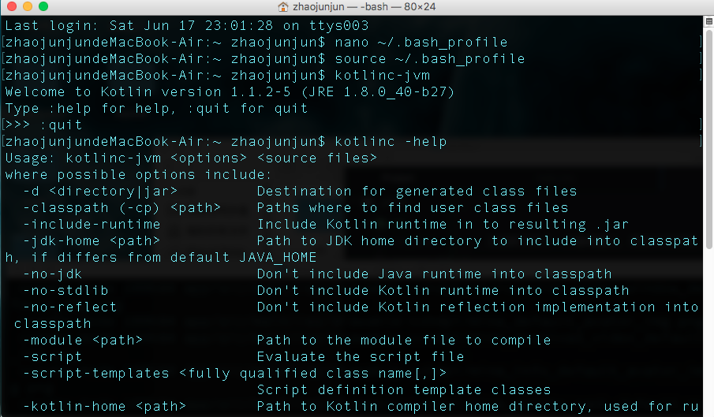

*在此深深地感谢 stormZhang ,帅比张，你最帅！！！*

以正确的姿势学习 Kotlin, 官方文档在这里：

[官网-kotlinl-tutorials-command-line](https://kotlinlang.org/docs/tutorials/command-line.html)

## 使用命令行编译器

>Working with the Command Line Compiler

官网上的教程将引导我们使用命令行编译器创建一个 Hello World 应用程序。

>This tutorial walks us through creating a Hello World application using the command line compiler.

*学生我搞 android 开发，一看到应用程序四个字，总觉得会是一个很大的东西，但是闷头一想，你写了哪怕几行代码，编译运行后，其功能只是输出一句话，那它也是个应用程序啊，我不能否认，所以，so easy,不用害怕。*

### 下载编译器

>Downloading the compiler

每个版本都附带编译器的独立版本。我们可以从 [GitHub Releases](https://github.com/JetBrains/kotlin/releases/tag/v1.1.2-5) 下载。最新版本是 1.1.2-5。

>Every release ships with a standalone version of the compiler. We can download it from GitHub Releases. The latest release is 1.1.2-5.

#### 手动安装

>Manual Install

将独立编译器解压缩到一个目录中，并可选择将 bin 目录路径地址添加到系统路径里。bin 目录中包含在 Windows，OS X 和 Linux 上编译和运行 Kotlin 所需的脚本。

>Unzip the standalone compiler into a directory and optionally add the bin directory to the system path. The bin directory contains the scripts needed to compile and run Kotlin on Windows, OS X and Linux.

todo 我用的这种方式，最简单，最高效，主要是其他几种方式，在我 mac 电脑上都有点问题。so ，不过当然那些问题后续都会再去解决的。


.zip 包下载完之后，解压，把解压后的文件夹，挪到个固定的，不会不小心删掉的地方，打开找到 bin 文件夹，然后配置在 Mac 上的环境变量，我还是整了个 Kotlin_Home ,以便后期更新 Kotlin ,当然如果你选的其他方式安装的，这个就省略啦,先打开几个 terminal 窗口待用。

```
$ nano ~/.bash_profile //使用 nano 命令打开 .bash_profile 修改环境变量

```

之后新打开了一个编辑窗口，添加以下代码

```
export KOTLIN_HOME=/Users/zhaojunjun/kotlinc

export PATH=$PATH:$KOTLIN_HOME/bin
```


按照提示保存配置并退出,之后输入以下命令使配置生效

```
source ~/.bash_profile
```

哒哒，接下来就是见证奇迹的时刻。

```
$ kotlinc -help //输入此命令后，若出现一些帮助命令，则安装配置成功
$ kotlinc-jvm //输入此命令，会进入交互式操作
```


## 创建并运行第一个应用程序

> Creating and running a first application

-1. 使用 Kotlin 创建一个简单的应用程序，显示一句话，例如 Hello，Kotlin !使用我们最喜欢的编辑器，我用的是 Atom, 主要是我写博客用的是 Markdown, Atom 也支持 .md 文件的预览，so ... ,在 Mac 上创建个固定的文件夹，里面专门用来放学习 Kotlin 相关的文件，创建一个名为 hello.kt 的新文件，Mac 上在 Finder 里不支持直接创建文件，只能新建文件夹，所以目前先用别的方式代替，粘贴复制改扩展名，扩展名为 .kt 代表是 Kotlin 文件，跟 .java 代表是 java 文件一样，然后使用 Kotlin 语言输入如下代码：

>Create a simple application in Kotlin that displays Hello, World!. Using our favorite editor, we create a new file called hello.kt with the following:

```
fun main(args: Array<String>) {
    println("Hello,Kotlin.My name is ZJ，I'm programming with kotlin.")
}
```

-2. 使用 Kotlin 编译器编译该应用程序

>Compile the application using the Kotlin compiler

```
$ kotlinc hello.kt -include-runtime -d hello.jar
```

>The -d option indicates what we want the output of the compiler to be called and may be either a directory name for class files or a .jar file name. The -include-runtime option makes the resulting .jar file self-contained and runnable by including the Kotlin runtime library in it. If you want to see all available options run : kotlinc -help

我们通过 kotlinc 去编译 hello.kt 文件，-include-runtime 选项，表示通过把 Kotlin 运行时库包含进来，来运行 hello.kt 中的代码，最后生成 .jar 文件。-d 选项表示，通过调用编译器的输出，最后生成 hello.jar ，kotlin 是基于 jvm（Java Virtual Machine) 的语言，最终还是生成 jar包的，当然也可以是类文件的目录名称或.jar文件名。其他的命令选项可以通过运行 kotlinc -help 来进行查看.
```

$ kotlinc hello.kt -include-runtime -d hello0.jar//生成的 jar包命名为 hello0.jar

$ kotlinc hello.kt -include-runtime -d hello20.jar //生成的 jar包命名为 hello20.jar

$ kotlinc hello.kt -include-runtime -d hello20 //生成 hello20 命名的目录文件夹 里面包含 .class文件等

$ kotlinc hello.kt -include-runtime -d hellofolder //生成 hellofolder 命名的目录文件夹 里面包含 .class文件等
```


其实也就20多种，命令也不多，可以整体看一看，了解一下。


